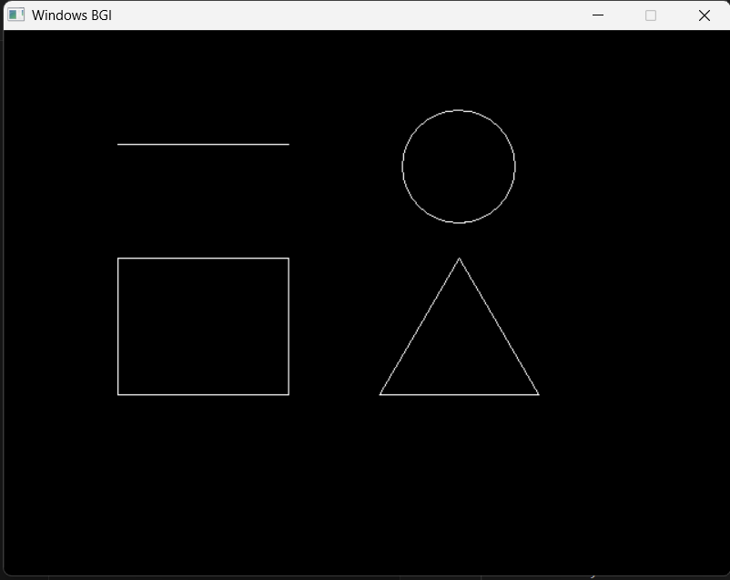
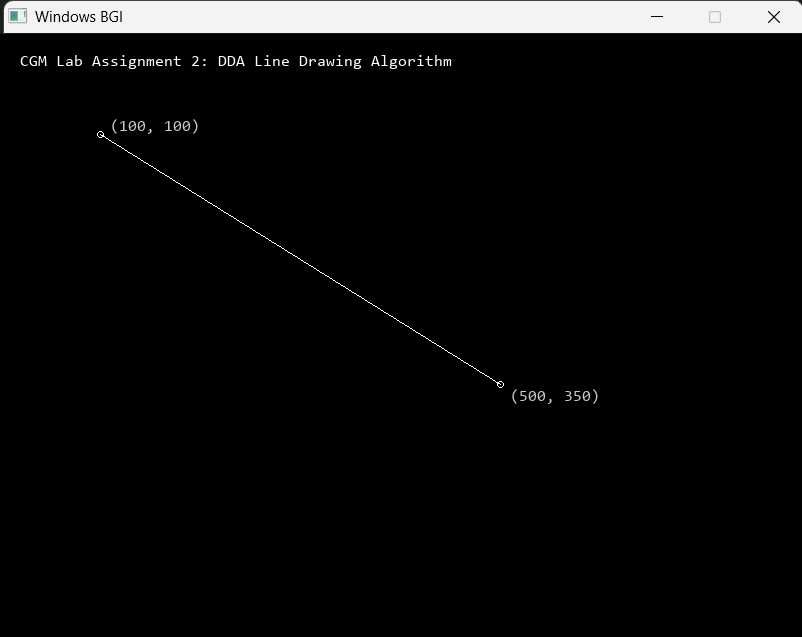

# Computer Graphics & Multimedia Lab

Repository for Computer Graphics & Multimedia (CGM) laboratory assignments implemented in C++ using the WinBGIm / `graphics.h` library.

---

## Lab Assignments

### 1. Assignment 1: Basic Primitives
- **Source File**: [`Home/src/basic_primitives.cpp`](Home/src/basic_primitives.cpp)
- **Description**: Implementation and graphical rendering of standard 2D primitives including lines, circles, rectangles, and triangles using standard graphics functions.
- **Output**:

  

---

### 2. Assignment 2: DDA (Digital Differential Analyzer) Line Drawing Algorithm
- **Source File**: [`Home/src/dda_line.cpp`](Home/src/dda_line.cpp)
- **Description**: Implementation of the Digital Differential Analyzer (DDA) algorithm for scan-converting and rasterizing a straight line pixel-by-pixel between two user-defined endpoints $(x_1, y_1)$ and $(x_2, y_2)$.
- **Algorithm Overview**:
  1. Compute $\Delta x = x_2 - x_1$ and $\Delta y = y_2 - y_1$.
  2. Determine the number of steps: $\text{steps} = \max(|\Delta x|, |\Delta y|)$.
  3. Calculate pixel increments per step: $x_{inc} = \frac{\Delta x}{\text{steps}}$ and $y_{inc} = \frac{\Delta y}{\text{steps}}$.
  4. Incrementally calculate $(x, y)$ coordinates and plot pixels using `putpixel(round(x), round(y), COLOR)` for each step.
- **Output**:

  

---

## Setup & Compilation Instructions

### Prerequisites
- **Compiler**: MinGW GCC/G++ (32-bit with WinBGIm library support)
- **Header Files**: `<graphics.h>`, `<conio.h>`

### Compilation via Command Line
To compile any source file with the required WinBGIm and Windows GDI libraries:

```powershell
g++ -g Home/src/dda_line.cpp -o Home/build/dda_line.exe -lbgi -lgdi32 -lcomdlg32 -luuid -loleaut32 -lole32
```

### Running the Executable
```powershell
./Home/build/dda_line.exe
```
